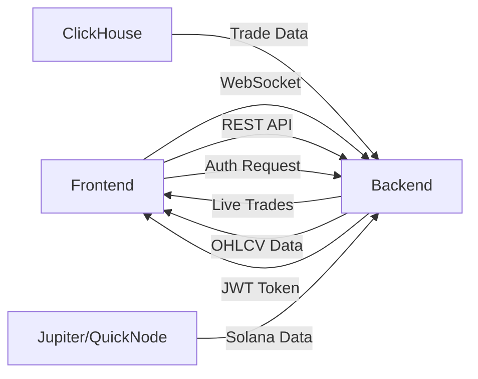

# Trade - Solana Trade Tracker

A real-time Solana trading terminal clone built with React, featuring live trade data streaming, TradingView charts, and Phantom wallet authentication.

## 🎯 Features

- **Real-time Trade Streaming**: WebSocket connection for live trade updates
- **TradingView Charts**: Interactive candlestick charts using Lightweight Charts
- **Phantom Wallet Authentication**: Secure authentication flow with signature verification
- **Live Price Statistics**: 24h price changes, volume, high/low tracking
- **Multi-Pair Support**: Switch between different trading pairs (SOL/USDC, BONK/SOL, etc.)
- **Dark Theme UI**: Modern, professional dark-themed interface matching Trade design

## 🏗️ Architecture

### Frontend Stack
- **React 18** with TypeScript
- **TailwindCSS** for styling
- **Lightweight Charts** for TradingView-style charts
- **Solana Wallet Adapter** for Phantom integration
- **WebSocket** for real-time data streaming

### Key Components

```
src/
├── components/
│   ├── Header.tsx              # Top navigation with wallet connection
│   ├── PriceStats.tsx          # 24h price statistics display
│   ├── TradingChart.tsx        # TradingView candlestick chart
│   ├── TradesTable.tsx         # Live trades list
│   ├── PairSelector.tsx        # Trading pair selector
│   ├── WalletButton.tsx        # Phantom wallet connect/auth button
│   └── TabsPanel.tsx           # Tabs for trades/orders/history
├── contexts/
│   └── WalletContext.tsx       # Wallet provider configuration
├── hooks/
│   └── usePhantomAuth.ts       # Phantom authentication logic
├── lib/
│   ├── api.ts                  # REST API client
│   ├── websocket.ts            # WebSocket client
│   └── utils.ts                # Utility functions
└── pages/
    └── Index.tsx               # Main trading page
```

## 🔐 Authentication Flow

The application implements a secure Phantom wallet authentication flow:

1. **User connects Phantom wallet** via Solana Wallet Adapter
2. **Frontend requests nonce** from backend (`GET /auth/nonce`)
3. **User signs the nonce** using Phantom wallet
4. **Frontend sends signature + public key** to backend (`POST /auth/verify`)
5. **Backend verifies signature** using ed25519 cryptography
6. **Backend returns JWT token** stored in localStorage
7. **Token used for authenticated API requests**

### Authentication Implementation

```typescript
// Hook usage in components
const { isAuthenticated, authenticate, logout, isLoading } = usePhantomAuth();

// Authenticate button
<Button onClick={authenticate}>Authenticate</Button>
```

The `usePhantomAuth` hook handles the entire flow automatically:
- Nonce retrieval
- Message signing
- Signature verification
- Token storage
- Session management

## 📡 API Integration

### REST API Endpoints

The application is ready to integrate with these backend endpoints:

```typescript
// Get recent trades
GET /api/trades?pair=SOL/USDC&limit=100

// Get OHLCV data for charts
GET /api/ohlcv?pair=SOL/USDC&interval=1m

// Get authentication nonce
GET /auth/nonce

// Verify signed nonce
POST /auth/verify
```

### WebSocket Connection

```typescript
// WebSocket endpoint for live trades
WS /ws/trades

// Message format
{
  id: string,
  timestamp: string,
  base_symbol: string,
  quote_symbol: string,
  price: number,
  amount: number,
  side: "buy" | "sell"
}
```

### API Configuration

Set backend URLs in `.env`:

```env
VITE_API_BASE_URL=http://localhost:8080
VITE_WS_BASE_URL=ws://localhost:8080
```

## 🚀 Getting Started

### Prerequisites

- Node.js 18+ and npm
- Phantom Wallet browser extension
- Backend server running (Rust + ClickHouse)

### Installation

1. Clone the repository:
```bash
git clone <repository-url>
cd solana-trade-stream
```

2. Install dependencies:
```bash
npm install
```

3. Configure environment:
```bash
cp .env.example .env
# Edit .env with your backend URLs
```

4. Start development server:
```bash
npm run dev
```

5. Open http://localhost:8080 in your browser

## 🎨 Design System

The application uses a custom dark theme design system with:

- **Primary Color**: Green (#22c55e) - matching Trade brand
- **Background**: Dark gray (#0a0e13)
- **Card Background**: Slightly lighter gray (#0f1419)
- **Success**: Green for buy orders
- **Destructive**: Red for sell orders
- **Border**: Subtle dark borders (#1a1e25)

All colors are defined as HSL values in `src/index.css` and used via semantic tokens throughout the application.

## 📊 Data Flow



## 🔧 Backend Integration Points

The frontend is fully prepared for backend integration. Key integration points:

### 1. Trade Streaming
- WebSocket client auto-connects on app load
- Subscribes to trade updates
- Updates UI in real-time
- Auto-reconnects on disconnect

### 2. Chart Data
- Fetches OHLCV data on pair/interval change
- Renders candlestick chart
- Auto-fits content on load

### 3. Authentication
- Complete Phantom wallet integration
- Nonce-based signature verification
- JWT token management
- Automatic session persistence

## 🧪 Testing Backend Integration

To test with your backend:

1. Start your Rust backend server
2. Update `.env` with correct URLs:
```env
VITE_API_BASE_URL=http://localhost:8080
VITE_WS_BASE_URL=ws://localhost:8080
```
3. Start frontend: `npm run dev`
4. Connect Phantom wallet
5. Authenticate
6. Watch live trades and charts update

## 📦 Build for Production

```bash
# Build optimized production bundle
npm run build

# Preview production build
npm run preview
```

The build output will be in the `dist/` directory, ready for deployment to:
- Netlify
- Vercel
- Any static hosting service

## 🛠️ Technology Stack

- **React 18.3** - UI framework
- **TypeScript** - Type safety
- **Vite** - Build tool
- **TailwindCSS** - Styling
- **Lightweight Charts 5.0** - TradingView charts
- **Solana Wallet Adapter** - Phantom integration
- **@solana/web3.js** - Solana blockchain interaction
- **TanStack Query** - Data fetching
- **Radix UI** - Accessible UI components

## 📝 Environment Variables

| Variable | Description | Default |
|----------|-------------|---------|
| `VITE_API_BASE_URL` | Backend REST API URL | `http://localhost:8080` |
| `VITE_WS_BASE_URL` | Backend WebSocket URL | `ws://localhost:8080` |
| `VITE_SOLANA_NETWORK` | Solana network | `mainnet-beta` |

## 🎯 Features Checklist

- ✅ Dark theme UI matching Trade
- ✅ Phantom wallet connection
- ✅ Phantom wallet authentication with nonce signing
- ✅ JWT token management
- ✅ WebSocket connection for live trades
- ✅ TradingView candlestick charts
- ✅ Real-time price statistics
- ✅ Trading pair selector
- ✅ Trades table with live updates
- ✅ REST API client ready
- ✅ Responsive design
- ✅ Error handling and loading states
- ✅ Auto-reconnect WebSocket
- ✅ Session persistence

## 🚦 Next Steps

Once backend is ready:

1. **Start backend server** with ClickHouse running
2. **Configure environment variables** in `.env`
3. **Test WebSocket connection** - trades should stream automatically
4. **Test authentication flow** - connect Phantom and authenticate
5. **Verify chart data** - OHLCV data should render on chart
6. **Check API responses** - ensure data matches expected format

## 📖 API Contract

### Trade Object
```typescript
interface Trade {
  id: string;
  timestamp: string; // ISO 8601
  base_symbol: string; // e.g., "SOL"
  quote_symbol: string; // e.g., "USDC"
  price: number;
  amount: number;
  side: "buy" | "sell";
}
```

### OHLCV Object
```typescript
interface OHLCVData {
  time: number; // Unix timestamp
  open: number;
  high: number;
  low: number;
  close: number;
  volume: number;
}
```

### Auth Objects
```typescript
interface AuthNonceResponse {
  nonce: string;
}

interface AuthVerifyRequest {
  publicKey: string;
  signature: string; // Base58 encoded
  nonce: string;
}

interface AuthVerifyResponse {
  token: string; // JWT
  expiresAt: string; // ISO 8601
}
```

## 🤝 Contributing

This is an assignment project. For any issues or questions, please refer to the assignment documentation.

## 📄 License

This project is created as part of an assignment.

---

**Built with ❤️ for Solana trading**
